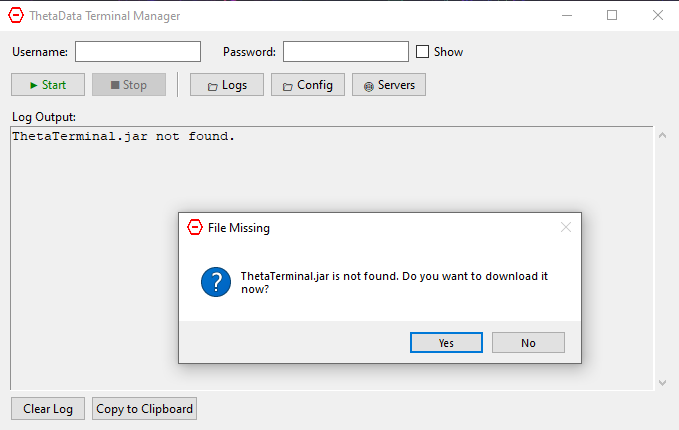
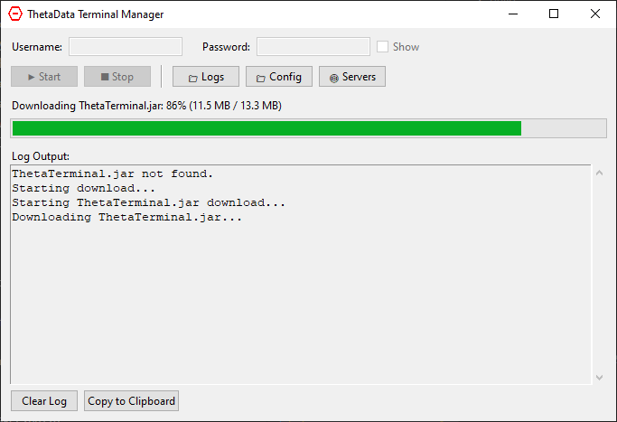
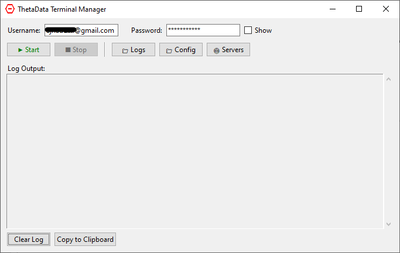
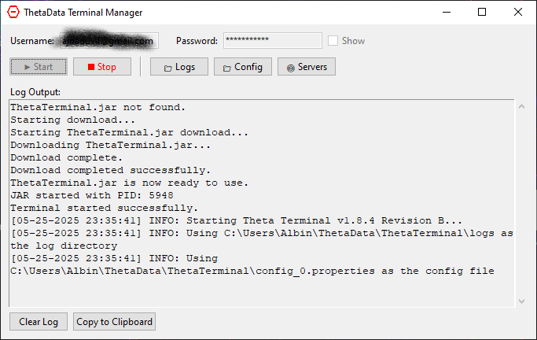
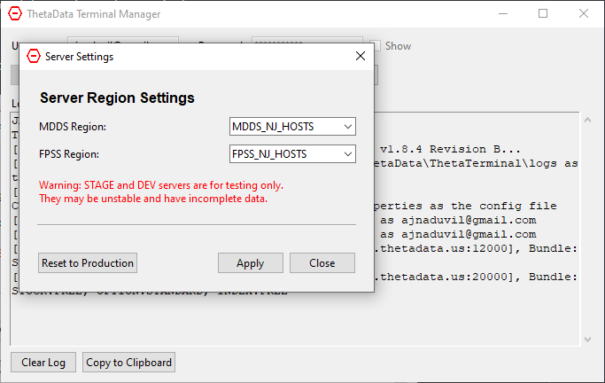

# ThetaData Terminal Manager

A Python application for managing [ThetaData's](https://www.thetadata.net/) ThetaTerminal.jar with a simple GUI interface.

## User Manual

### For End Users (Non-Technical)

This section is for users who just want to use the ThetaData Terminal Manager application without setting up a development environment.

#### Quick Start Guide

1. **Download the Application**
   - Download the latest `ThetaDataTerminalManager.exe` from the releases section
   - No installation required - it's a standalone executable

2. **First Time Setup**
   - Double-click `ThetaDataTerminalManager.exe` to launch the application
   - You will be prompted to download the thetaterminal.jar file if it's not present
   
   
    

   

3. **Using the Application**
   - Enter your [ThetaData](https://www.thetadata.net/) username and password in the provided fields   
   
   
   - **Username/Password**: Enter your ThetaData credentials
   - **Show Password**: Check this box to reveal your password while typing
   - **Save Credentials**: Your credentials will be saved securely for future use
   - **Start Button**: Click to launch the ThetaTerminal
   - **Stop Button**: Click to terminate the ThetaTerminal
   - **Logs Button**: Open the logs folder to view ThetaTerminal log files
   - **Config Button**: Open the configuration folder
   - **Servers Button**: Configure server regions (MDDS/FPSS settings)
   - **Log Area**: View real-time output from the terminal
   - **Clear Log**: Clear the log display
   - **Copy Log**: Copy log contents to clipboard

4. **Starting the Terminal**
   - Click the "Start" button to launch ThetaTerminal
   - The log area will show the terminal's output
   - Wait for the terminal to fully initialize before using it
   
   

5. **Stopping the Terminal**
   - Click the "Stop" button to safely terminate the terminal
   - Wait for the process to fully stop before closing the application

6. **Server Configuration** (Advanced Users)
   
   
   
   - Click the "🌐 Servers" button to open server settings
   - **MDDS Region**: Select the market data server region
   - **FPSS Region**: Select the fundamental data server region
   - **Production Servers**: Use NJ_HOSTS for live trading data
   - **Testing Servers**: STAGE and DEV servers are for testing only
   - **Reset to Production**: Quickly reset both regions to production servers
   - Changes take effect when ThetaTerminal is restarted

#### System Requirements

- **Operating System**: Windows 10 or newer
- **Java**: Java Runtime Environment (JRE) 8 or newer must be installed
  - Download from: https://www.java.com/download/
- **Internet Connection**: Required for initial ThetaTerminal.jar download

#### Troubleshooting

**Application won't start:**
- Ensure Java is installed on your system
- Try running as administrator
- Check Windows Defender/antivirus isn't blocking the application

**Can't connect to ThetaData:**
- Verify your username and password are correct
- Check your internet connection
- Ensure ThetaData services are operational

**Terminal crashes or stops unexpectedly:**
- Check the log area for error messages
- Try restarting the application
- Ensure you have sufficient system resources

**Server configuration issues:**
- Server settings only work after ThetaTerminal has run at least once
- Use production servers (NJ_HOSTS) for live data
- Test servers may have incomplete or unstable data
- Changes require restarting ThetaTerminal to take effect

#### Getting Help

If you encounter issues:
1. Check the log area for error messages
2. Take a screenshot of any error dialogs
3. Report issues on the GitHub repository with:
   - Your operating system version
   - Java version (run `java -version` in command prompt)
   - Screenshot of the error
   - Contents of the log area

---

## Developer Documentation

### For Developers and Technical Users

This section contains technical information for developers who want to build, modify, or contribute to the project.

## Features

- Automatically downloads ThetaTerminal.jar if not present
- Saves and loads username/password credentials
- Start and stop ThetaTerminal with a click
- Log viewing with clear and copy functionality
- Password reveal option for ease of use

## Requirements

- Python 3.12 or newer
- Java Runtime Environment (JRE) for running ThetaTerminal.jar
- uv package manager

## Installation

1. Clone this repository
2. Install uv if you haven't already:
   ```
   # On Windows
   powershell -c "irm https://astral.sh/uv/install.ps1 | iex"
   
   # On macOS/Linux
   curl -LsSf https://astral.sh/uv/install.sh | sh
   
   # Or with pip
   pip install uv
   ```

3. Install dependencies and create virtual environment:
   ```
   uv sync
   ```

## Usage

Run the application:
```
uv run main.py
```

Or activate the virtual environment and run directly:
```
# Activate the environment
source .venv/bin/activate  # On Unix/macOS
# or
.venv\Scripts\activate     # On Windows

# Run the application
python main.py
```

1. Enter your ThetaData username and password
2. Click "Start" to launch the terminal
3. The log area will display output from the terminal
4. Click "Stop" to terminate the terminal when done

## Development

To work on the project:

1. Install development dependencies:
   ```
   uv sync --dev
   ```

2. Add new dependencies:
   ```
   uv add package-name
   ```

3. Add development dependencies:
   ```
   uv add --dev package-name
   ```

## Version Management

To update the version number:

```bash
# Update to version 1.0.1
uv run python update_version.py 1 0 1

# Update to version 1.2.0 build 5
uv run python update_version.py 1 2 0 5
```

This will automatically update:
- `version_info.py` - Version metadata for the executable
- `pyproject.toml` - Package version

The version information will be embedded in the built executable and visible in Windows Properties.

## Building Executable

To build a standalone executable:

### Using the build script (recommended)

1. Ensure dependencies are installed:
   ```
   uv sync
   ```

2. On Windows, run:
   ```
   build.bat
   ```
   
   Or run the Python build script directly:
   ```
   uv run build.py
   ```

3. The executable will be created in the `dist` directory

### Using PyInstaller directly

You can also build with PyInstaller directly:

```
uv run pyinstaller --name=ThetaDataTerminalManager --onefile --windowed main.py
```

## Structure

- `main.py` - Entry point for the application
- `app/terminal_manager.py` - Core logic for managing the terminal
- `app/ui/main_window.py` - User interface implementation
- `build.py` - Build script for creating the executable
- `pyproject.toml` - Project configuration and dependencies

## License

MIT

## Author

Created by [ajnaduvil](https://github.com/ajnaduvil)

## Troubleshooting

### Virtual Environment Conflicts

If you see warnings about `VIRTUAL_ENV` not matching or if you have an old pipenv environment active, you can:

1. Run `deactivate.bat` to clear old virtual environment variables
2. Or manually deactivate pipenv: `exit` from the pipenv shell
3. The `build.bat` script automatically handles this by clearing environment variables

### Build Issues

If the build fails:
1. Ensure all dependencies are installed: `uv sync`
2. Check that Python 3.12+ is available
3. Verify Java Runtime Environment is installed for ThetaTerminal.jar

### Icon Issues

If the executable doesn't show the custom icon:

1. **Verify icon is included**: The build script will show "Using icon: --icon=app\resources\icon.ico" if found
2. **Refresh Windows icon cache**: Run `refresh_icon.bat` to clear and refresh the icon cache
3. **Check icon format**: Ensure the icon.ico file is a valid Windows icon format
4. **Alternative icons**: The build script will try these files in order:
   - `app/resources/icon.ico`
   - `app/resources/icon_32x32.ico` 
   - `app/resources/icon_128x128.ico`
5. **Manual verification**: Right-click the executable → Properties to see if the icon appears there 